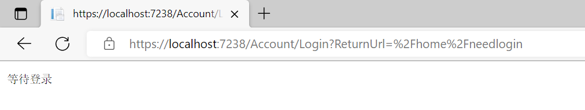
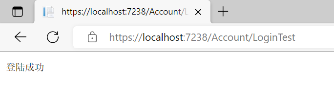
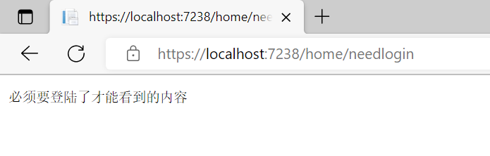

# 一个最简单的认证示例

上文讲了认证和授权的区别，可以感觉到授权是在认证之上的，必须先经过认证才会有授权（如果进不了站，也就检不了票），因此从认证的开始，先简单介绍一下认证的过程

首先创建一个Asp.Net Core MVC项目
```shell
dotnet new mvc -n HelloAuthentication
```
创建好后添加对应的认证中间件和认证方案，Asp.Net Core将认证和授权分开后可以更方便的支持多种认证方案，这里考虑到HelloWorld应该更简单，所以选择了默认实现了的、配置较少的Cookie方案

在Program.cs文件中添加认证中间件和配置认证方案
```csharp{8-22,39-40}
using Microsoft.AspNetCore.Authentication.Cookies;

var builder = WebApplication.CreateBuilder(args);

// Add services to the container.
builder.Services.AddControllersWithViews();

// CookieAuthenticationDefaults.AuthenticationScheme值为Cookies，
// AddAuthentication()中的字符串名字代表了默认要使用的认证方案
// 这里是指定默认的认证方式为Cookies
builder.Services.AddAuthentication(CookieAuthenticationDefaults.AuthenticationScheme)
    // 添加Cookie认证方式，这里AddCookie()提供了两个参数，第一个参数指定了身份验证方案名
    // 第二个参数是一个Action委托，用于指定认证行为
    .AddCookie(CookieAuthenticationDefaults.AuthenticationScheme, options =>
    {
        // 如果没有认证跳转到的登陆地址
        options.LoginPath = "/Account/Login";
        // 拒绝访问时跳转到的地址
        options.AccessDeniedPath = "/forbid";
        
        // 还有很多其他配置选项
    });

var app = builder.Build();

// Configure the HTTP request pipeline.
if (!app.Environment.IsDevelopment())
{
    app.UseExceptionHandler("/Home/Error");
    // The default HSTS value is 30 days. You may want to change this for production scenarios, see https://aka.ms/aspnetcore-hsts.
    app.UseHsts();
}

app.UseHttpsRedirection();
app.UseStaticFiles();

app.UseRouting();

// 认证中间件
app.UseAuthentication();

app.UseAuthorization();

app.MapControllerRoute(
    name: "default",
    pattern: "{controller=Home}/{action=Index}/{id?}");

app.Run();

```

配置好认证和授权中间件之后，添加一个需要认证才能访问的资源，在添加需要认证的资源之前，先添加用于登录和退出的Controller，我这里添加的AccountController，也可以用其他的名字，在MVC中Controller的名字会映射为路由地址，如果用其他名字记得变更后面测试时的URL地址即可
```csharp
public class AccountController : Controller
{
    public IActionResult Login()
    {
        return Content("等待登录");
    }

    public async Task<IActionResult> LoginTest()
    {
        // 身份信息，会被解析到HttpContext.User中

        //这里方案的ClaimsIdentity的构造函数的参数要和下面的SignInAsync的方案名一致
        var claimIdentity = new ClaimsIdentity(CookieAuthenticationDefaults.AuthenticationScheme);
        claimIdentity.AddClaim(new Claim(ClaimTypes.Role, "User"));

        // 将身份信息编码后写入Cookie
        await HttpContext.SignInAsync(CookieAuthenticationDefaults.AuthenticationScheme, new ClaimsPrincipal(claimIdentity),
            new AuthenticationProperties
            {
                // 凭据过期时间
                ExpiresUtc = DateTime.UtcNow.AddMinutes(30)
            });

        return Content("登陆成功");
    }

    public async Task<IActionResult> LoginAdminTest()
    {
        // 身份信息，会被解析到HttpContext.User中

        //这里方案的ClaimsIdentity的构造函数的参数要和下面的SignInAsync的方案名一致
        var claimIdentity = new ClaimsIdentity(CookieAuthenticationDefaults.AuthenticationScheme);
        claimIdentity.AddClaim(new Claim(ClaimTypes.Role, "Admin"));

        // 将身份信息编码后写入Cookie
        await HttpContext.SignInAsync(CookieAuthenticationDefaults.AuthenticationScheme, new ClaimsPrincipal(claimIdentity),
            new AuthenticationProperties
            {
                // 凭据过期时间
                ExpiresUtc = DateTime.UtcNow.AddMinutes(30)
            });

        return Content("登陆成功");
    }

    public async Task<IActionResult> Logout()
    {
        await HttpContext.SignOutAsync();
        return Content("退出登录成功");
    }
}
```

这里添加了四个Action，分别是Login、LoginTest、LoginAdmin、Logout。Login用来演示未认证访问需要认证的资源时的重定向效果；LoginTest执行普通用户登录，这里为了方便就不写View用Post登录了，只是简单的演示效果；LoginAdmin执行Admin角色用户登录；Loginout执行退出登录

添加完跟账户有关的Action之后再添加需要认证才能访问的资源

在项目模板中的**HomeController**中添加需要认证才能访问的Action
```csharp
[Authorize]
public IActionResult NeedLogin()
{
    return Content("必须要登陆了才能看到的内容");
}
```
这个Action与公开的Action一样，但是使用了`Authorize`特性标注，Asp.Net Core如果检查到了Authorize特性，在用户访问时，就会检查用户是否经过了认证，如果用户没有经过认证，则会重定向到前面在Program中配置的LoginPath路由，并带上重定向地址，在登陆成功后重定向回当前地址

```
https://localhost:7238/home/needlogin
```
::: tip 注意
以前Asp.Net Core新建的项目端口默认是5000和5001，现在好像是随机的，在自己测试时，请根据自己的端口修改URL
:::
当未登录的时候，访问需要认证的资源NeedLogin，会自动重定向到上面配置的Login地址，后面会更上



页面自动跳转到了配置的登录地址/Account/Login，并携带了原来的访问的URL作为ReturnUrl参数，当登录（经过认证）成功，就可以根据ReturnUrl参数的值进行重定向，跳转回原来的页面

接下来将这个等待登录的URL地址中的Login变更为LoginTest，因为LoginTest包含了写入Cookie身份信息（使用Cookie认证）的方法，访问LoginTest就会登录成功

```
https://localhost:7238/Account/LoginTest
```



接下来再访问NeedLogin资源

```
https://localhost:7238/home/needlogin
```
就可以正常访问到对应的资源了



在这个例子中，使用的是以Cookie作为认证手段，同时Asp.Net Core也是支持其他方案的，也可以自定义认证方案，就像进火车站除了身份证，还可以用护照、户口本、行驶证之类的证件，这个就根据自己的需要自行选择，Cookie是最简单方便的一种，所以就以Cookie进行演示

认证之后，多久需要重新认证呢？根据Program里面的配置，如果三十分钟没有操作，Cookie就会失效。除了自然失效，关闭浏览器和调用Logout退出登录都会收回认证，收回认证后便不能再访问了，如果需要再次访问则需要再次进行登录


在上面的AccountController中的Login和Logout Action中，使用了SignIn和SignOut两个API，它们是用于认证的抽象接口，在Program中配置为Cookie方案时，Asp.Net Core内置的Cookie方案程序实现了这两个API，它们将身份信息进行编/解码，写入/读取Cookie值，以此将认证的结果保存下来。但是并不是所有的方案都实现了这两个API，比如JWT方案中就没有实现这两个API，因为JWT并没有撤销的概念，因此不需要SignIn和SignOut（这一段权当废话，如果才接触不知道什么是JWT可以不用管）

至此，一个简单的认证HelloWorld就写完了，这个案例中配置了认证方案，使用Authorize特性保护了NeedLogin资源，使其必须要经过认证的用户才能访问