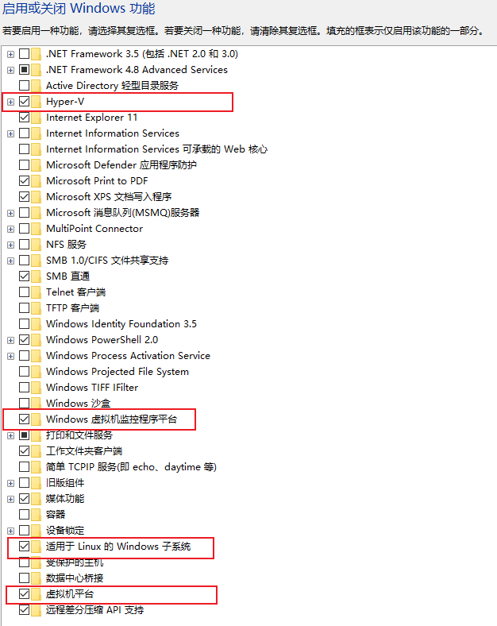
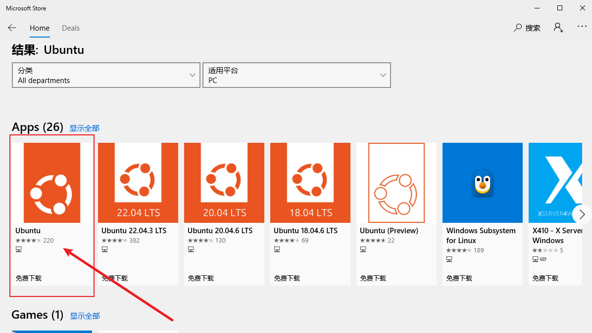
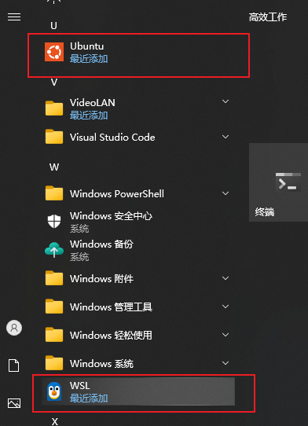

# Docker Desktop在Windows上的安装

> 有朋友最近学习的时候用到了Docker，但是他自己装一直没装上，因此这里稍微写写。其实Docker Desktop在Windows上的安装一直下一步就行了，但是也有一点小坑，那就是现在的Docker是需要WSL2的，因此必须先把WSL安装好

## 安装Docker Desktop的前的准备

### 启用Hyper-v

因为Docker Desktop需要依赖WSL2，因此需要先把WSL2安装好

WSL2是基于Hyper-v的技术，因此要在Windows功能中把Hyper-v相关的功能启用，以下是我启用的

这里面可能有些冗余，但是与之相关的都在里面了，应该不会出错。

### 安装WSL2内核

安装WSL2微软提供了[文档](https://learn.microsoft.com/zh-cn/windows/wsl/install-manual)，这里面的第一步启用适用于 Linux 的 Windows 子系统刚刚已经通过图形界面启用了，这里不用再执行了

第二步是确认运行要求，这里我用的是Win10的工作站版，理论上除了家庭版应该都行，然后微软有个LSTC版，我试了一下，运行不了，也许有其他人知道怎么弄吧，但我这边就是安装了运行不了

第三步是启用虚拟机功能，这一步在前面的图形界面也是一并启用了，这里不需要再操作了

第四步是下载Linux内核更新包，这里就是下载出来安装就好了。下载地址：[适用于 x64 计算机的 WSL2 Linux 内核更新包](https://wslstorestorage.blob.core.windows.net/wslblob/wsl_update_x64.msi)

第五步是设置WSL默认使用2版本，以前有过WSL1，它与WSL2各有优劣，但是微软肯定是只搞2了，因为WSL2不用单独维护内核及周边
```shell
wsl --set-default-version 2
```

第六步就是安装一个WSL发行版，这里推荐是使用Ubuntu，我之前试过其他的，好像要Ubuntu才可以。安装WSL发行版可以使用Microsoft Store来安装，毕竟图形界面，简单易操作

这里选这个Ubuntu，之前我试过其他版本的Ubuntu，好像也不行，不知道是哪里弄错了，但是这个倒是每次都可以

第七步是微软的文档没有的，这一步需要点开下载的Ubuntu，进行配置激活，最后能进到Ubuntu系统里面就行成了

安装完成后一定有两个

有时候我发现开始菜单没有WSL，这时候安装Docker后运行就会一直卡在启动Docker Engine，如果开始菜单没有WSL，就执行
```shell
wsl --update
```
更新一下，一般情况下，更新完之后就有WSL了

### 安装Docker Desktop

在Winddows上安装程序基本上都是非常简单的事情，如果上面的每一步都做了，那么这里只需要点开Docker Desktop的安装包，一直下一步就好。如果启动后发现一直卡在启动Docker Engine，按照上面的安装WSL的步骤走一遍，再重新安装Docker，应该是不会有问题了，这里就不再写简单的点下一步了。