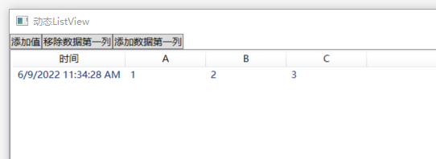
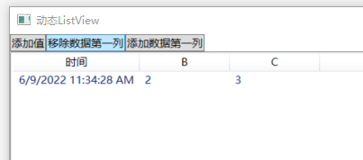
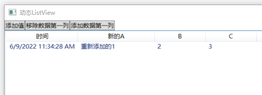

# WPF动态生成ListView，根据内容自动渲染列

最近写代码的时候遇到了这样一个需求，在一个页面中需要用ListView显示数据，但是这个地方会因为接入的设备不同，而接收不同的的数据，在ListView中也要根据对应的数据种类，显示出正确的表头和内容

经过一番测试，可以用下面的方法来动态的决定ListView的列和对应的绑定

首先，不能将ListView的列定义在XAML之中，如果写在XAML中，那么这个列和绑定关系则基本就定下来了，因此只能在后台中去绑定对应的列


### 固定的写法

平时使用ListView，大都是下面这种提前在XAML中将绑定写好了，不能在运行时根据需要进行动态增减列
```xml
<ListView Grid.Row="1" ItemsSource="{Binding Data}">
    <ListView.View>
        <GridView>
            <GridView.Columns>
                <GridViewColumn Header="时间" DisplayMemberBinding="{Binding Time}" />
                <GridViewColumn Header="A" Width="100" DisplayMemberBinding="{Binding DynamicData[0]}"></GridViewColumn>
                <GridViewColumn Header="B" Width="100" DisplayMemberBinding="{Binding DynamicData[1]}"></GridViewColumn>
                <GridViewColumn Header="C" Width="100" DisplayMemberBinding="{Binding DynamicData[2]}"></GridViewColumn>
            </GridView.Columns>
        </GridView>
    </ListView.View>
</ListView>
```


从上面来看，ListView是通过`GridViewColumn`来进行绑定的，因此，若要动态调整，则需要动态调整对应的`GridViewColumn`，因此可以通过后台代码重新关联`GridViewColumn`进行操作

### 动态的写法

```xml{1}
<ListView Grid.Row="1" Name="DynamicListViewControl" ItemsSource="{Binding Data}">
    <ListView.View>
        <GridView>
            <GridView.Columns>
                <GridViewColumn Header="时间" DisplayMemberBinding="{Binding Time}" />
                <GridViewColumn Header="A" Width="100" DisplayMemberBinding="{Binding DynamicData[0]}"></GridViewColumn>
                <GridViewColumn Header="B" Width="100" DisplayMemberBinding="{Binding DynamicData[1]}"></GridViewColumn>
                <GridViewColumn Header="C" Width="100" DisplayMemberBinding="{Binding DynamicData[2]}"></GridViewColumn>
            </GridView.Columns>
        </GridView>
    </ListView.View>
</ListView>
```
可以通过在给ListView绑定一个Name，这样就可以在后台拿到对应的ListView控件了
```csharp
// 拿到对应的GridView
var gridView = (GridView)DynamicListViewControl.View;

// 移除第一列
gridView.Columns.RemoveAt(1);
```
只要能拿到ListView的GridView，就可以对ListView的绑定进行操作了，这里演示了删除一列


也可以添加一列
```csharp
// 拿到对应的GridView
var gridView = (GridView)DynamicListViewControl.View;

var binding = new Binding()
{
    Path = new PropertyPath("DynamicData[0]"),
    StringFormat = "重新添加的########"
};

// 创新新的GridViewColumn
var gridViewColumn = new GridViewColumn() { Header = "新的A", DisplayMemberBinding = binding, Width = 150 };
// 添加到GridView中
gridView.Columns.Insert(1,gridViewColumn);
```


改变绑定、改变样式、改变顺序，都可以以这样的方式进行操作

示例的完整源代码：[Gitee-DynamicListView](https://gitee.com/wujunchengman/doc-example/tree/master/DynamicListView)