# 使用Nginx反向代理本地服务（无固定公网IP通过端口映射公开的服务）的坑

前言：之前公司的服务器都是云服务器，性能比较差，而我们有一些内部使用的系统和极少数外部用户使用的系统，对资源有一定的要求，也不要求多少个的9的可靠性，于是我们买了一台服务器，将这类服务放在了本地。这一部分服务有时候也需要外网访问，非专线宽带80端口和443端口都不能使用，于是通过云服务器上的Nginx反向代理这部分服务，在这个过程中，踩了一些坑，这里记录下来

## 网络结构



在这个网络中，因为用公网IP，虽然不是固定的，还是可以通过使用其他端口的方式访问，但是用户在使用时就需要使用带端口号的地址，这样看起来不是很正规（主要是个人洁癖），于是设计成了这样的一个网络结构，可能有部分同学会觉得这样很浪费云服务器的带宽，这一点我也考虑过，我们的服务大部分是前后端分离项目，前端用了CDN，后端使用直接映射的域名和端口，不走代理，只有部分前后端不分离项目会耗带宽一点，但是大部分访问都是内网访问，已经通过内部的DNS直接解析到了本地地址，不会从云上绕一圈，因此带宽也是可以接受的

## 配置文件（有问题版）
```conf
	server {
        listen       80;
        server_name  a.domain.com c.domain.com c.domain.com;

		location / {
			proxy_pass         http://local.domain.com:6666;
			proxy_http_version 1.1;
			proxy_set_header   Upgrade $http_upgrade;
			proxy_set_header   Connection keep-alive;
			proxy_set_header   Host $host;
			proxy_cache_bypass $http_upgrade;
			proxy_set_header   X-Forwarded-For $proxy_add_x_forwarded_for;
			proxy_set_header   X-Forwarded-Proto $scheme;
		}
    }
```
这是一个常规的反向代理，因为以前一直这么用的，按照正常来说应该不会出问题，刚配上的时候，确实是可以的，然后到了下午，突然就无法访问了，查看Nginx错误日志

`10060: A connection attempt failed because the connected party did not properly respond after a period of time, or established connection failed because connected host has failed to respond`

最开始以为是配置的问题，经过仔细检查，发现配置确实没有错误，于是选择`nginx -s reload`重新加载，重新加载后服务又正常了，一时间不知道发生了什么，后来一阵搜索，发现是**当使用域名作为反向代理时，Nginx会缓存域名解析后的IP地址，直到重启Nginx服务或重新加载配置文件**，反向代理的域名使用DDNS服务将解析IP地址始终保持为对应的公网IP地址，但是毕竟是动态公网，每隔一段时间公网地址会刷新，刷新后Nginx还是反向代理的以前的IP地址，也就造成了服务无法访问

在搜索的问题的过程中，也找到了问题的解决办法，就是让域名解析后的地址不一直缓存，而是每隔一段时间刷新，Nginx的官方解决方案是resolver，下面是网上的关于resolver的

[大佬的文章](https://www.jianshu.com/p/5caa48664da5)

看完之后，对配置文件做了如下修改，反向代理到本地服务器就正常了

## 配置文件（修复版）

```conf
	server {
        listen       80;
        server_name  a.domain.com c.domain.com c.domain.com;


		resolver 119.29.29.29 valid=30s;
		set $loaclserver http://local.domain.com:6666;

		location / {
			proxy_pass         $loaclserver;
			proxy_http_version 1.1;
			proxy_set_header   Upgrade $http_upgrade;
			proxy_set_header   Connection keep-alive;
			proxy_set_header   Host $host;
			proxy_cache_bypass $http_upgrade;
			proxy_set_header   X-Forwarded-For $proxy_add_x_forwarded_for;
			proxy_set_header   X-Forwarded-Proto $scheme;
		}
    }
```

看了上面提到的大佬关于resolver的用法的文章，对配置文件做了一些修改，将代理的地址设为了变量，设置了解析域名的DNS服务器，解析值30秒过期，然后代理访问本地的服务就正常了

这中间有个小插曲，一度让我觉得这个方法没有作用，因为最开始我设置的DNS是114.114.114.114，这个DNS可能是国内公共DNS知名度最高的一个了，但是这个DNS好像没有刷新我的域名解析，在更改了解析值十多分钟后还是解析为原来的解析值，后来换了DNSPod的公共DNS，表示很好用