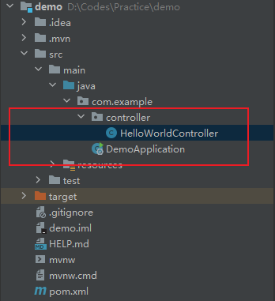

# Spring Boot版的Hello Woeld

上面创建了一个Spring Boot项目，依据惯例，这里写一个Hello World

## 创建控制器

在SpringBootApplication所在的包下创建一个controller包，然后创建一个HelloWorldController



下面是HelloWorldController的具体内容
```java
// 包名，包结构不同这里就不同
package com.example.controller;

import org.springframework.web.bind.annotation.GetMapping;
import org.springframework.web.bind.annotation.RequestMapping;
import org.springframework.web.bind.annotation.RestController;

// 指定这是一个Rest风格的Controller
@RestController
// 指定请求的地址为 根路径+ /helloworld
@RequestMapping("/helloworld")
public class HelloWorldController {
    // 指定HTTP Get访问的请求处理
    @GetMapping
    public String helloWorld(){
        // 返回对应的数据
        return "HelloWorld";
    }
}

```
这个Controller指定了通过get请求/helloworld这个路径的返回值为HelloWorld，因为没有对项目进行额外的配置，这里的默认项目地址是http://localhost:8080 ，根据路由规则，访问http://localhost:8080/helloworld 就可以看到对应的返回值


至此这个HelloWorld就算写完了
