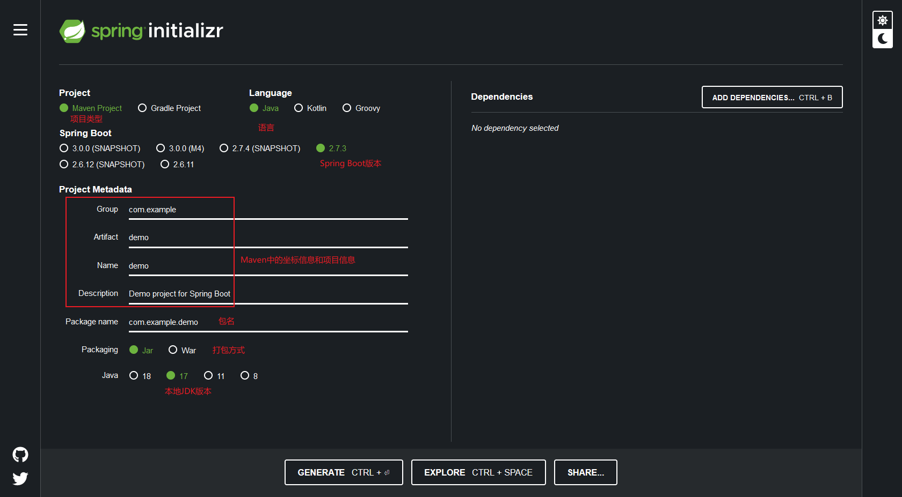
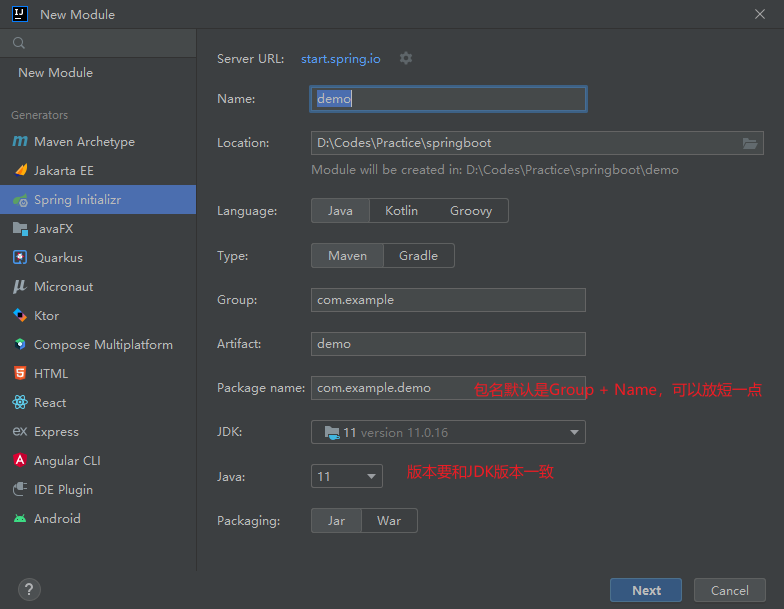
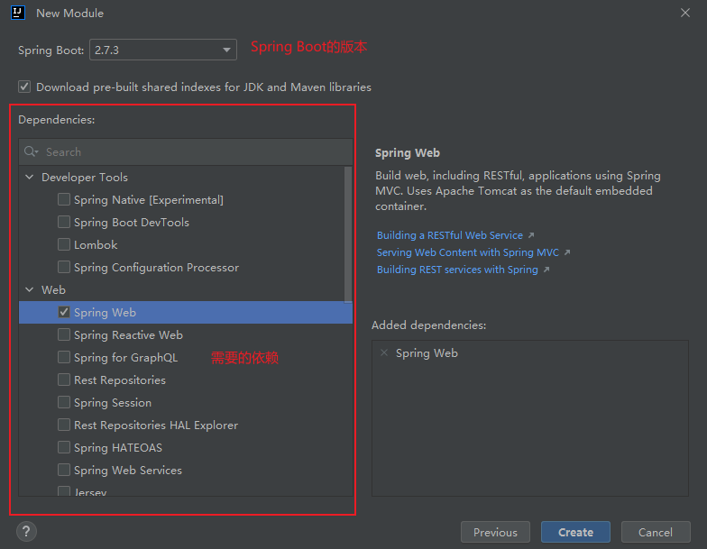

# 创建Spring Boot项目

Spring Boot是用来简化Spring项目开发的，所以最后的核心还是会回到Spring之上，但是Spring Boot通过一系列的约定，将一部分原本不配置就无法运行且配置繁琐而大家又都配得一样的东西通过默认值、注解等方式简化了对应配置。因此，我个人认为如果要学习Spring生态，从Spring Boot开始或者比从Spring开始可能会更好

虽然可以手动创建Spring Boot项目，但是这就比较麻烦了，除非是没网的内网开发，否则还是使用自动生成的好，毕竟简单方便

## 通过Spring官网的代码生成器生成Spring Boot项目

[Spring Boot官网在线生成器]("https://start.spring.io/")

在官网的生成器中创建填写上对应的项目信息，添加所需要的依赖，点击Generate按钮，会自动下载一个对应的压缩包，将这个压缩包解压缩便是完整的项目

## 通过IDEA创建Spring Boot项目

IDEA是目前Java开发中使用得最多的开发工具，其旗舰版内置了对Spring的支持，在创建代码时提供了对应的生成器选项

IDEA的社区版是移除了Spring的支持的，因此社区版并不能拿来开发Spring Boot项目，此时要么用IDEA的旗舰版，要么用Eclipse或者VS Code

## Eclipse/VS Code

Spring提供了对应的插件，安装上对应的插件，就可以创建Spring Boot项目了，这里有机会再详述，操作都差不多，明白了生成器的每个选项代表什么都能轻松生成